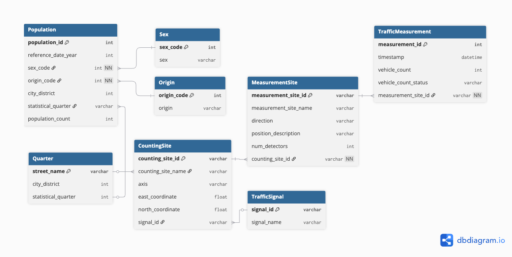
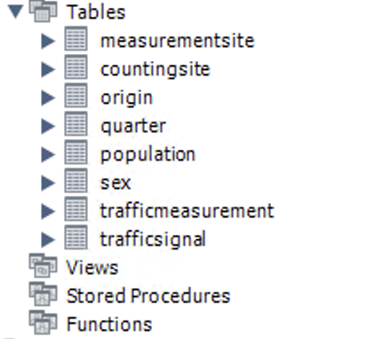
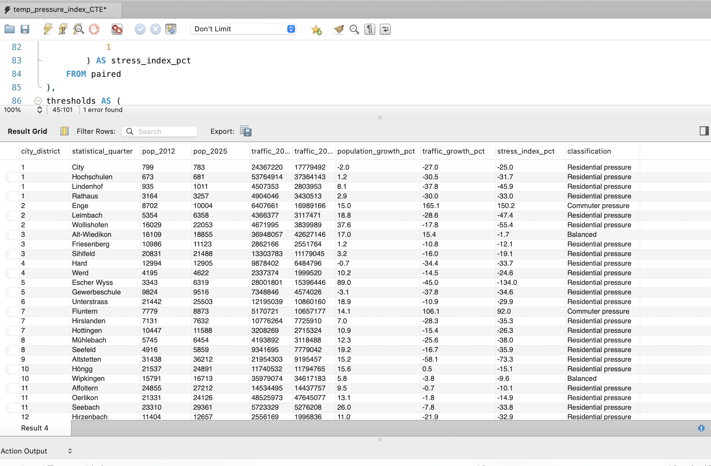
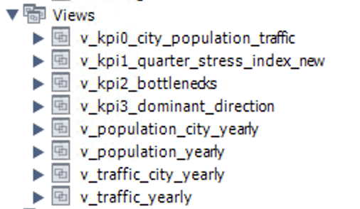
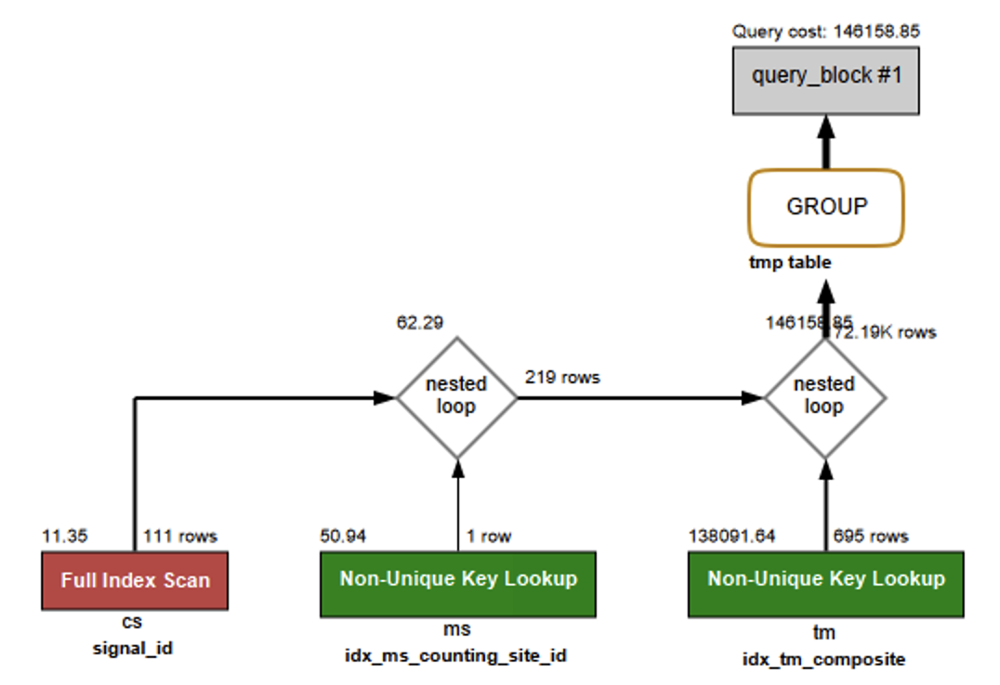
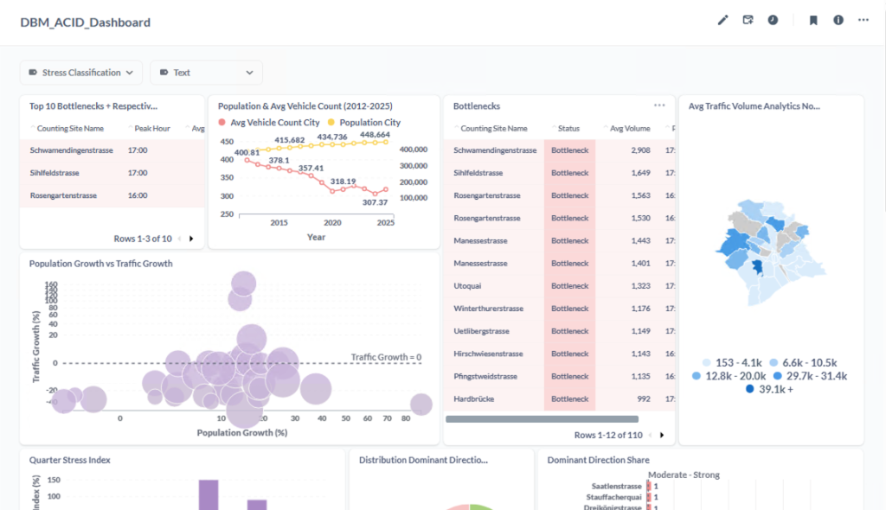
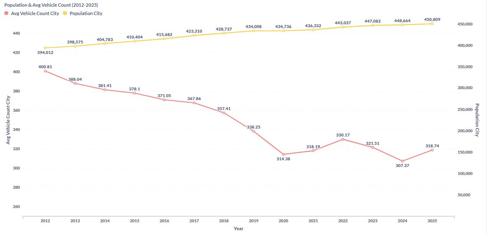
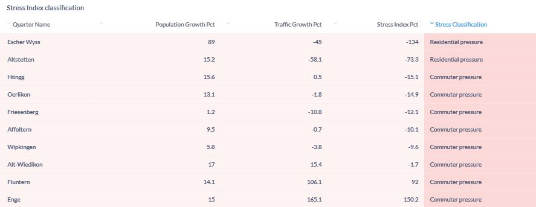
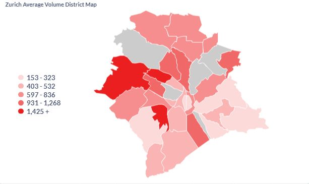
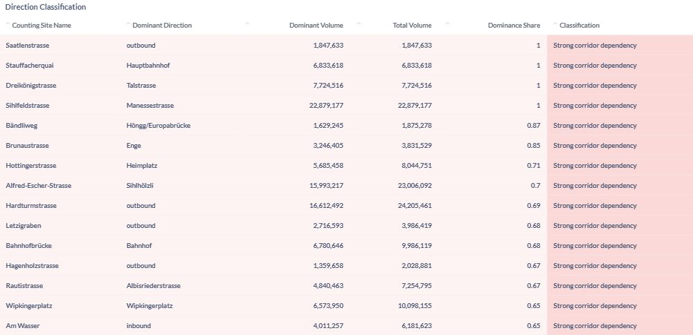

```{r setup, include=FALSE}
knitr::opts_chunk$set(echo = FALSE)
```
\newpage
# Introduction & Context

The City of Zurich faces growing challenges related to traffic congestion, mobility planning, and urban development. As the population increases and commuting patterns evolve, many intersections and arterial roads experience significant pressure, particularly during peak hours. Congestion affects not only travel times but also road safety, air quality, and the overall effectiveness of the city’s transport network.

Urban planning authorities make complex decisions about where to prioritize infrastructure investments, how to optimize traffic signals, and which areas require redesign or alternative mobility solutions. These decisions rely heavily on an accurate understanding of traffic flows, patterns, directional imbalances, and long-term trends.

To contribute to this goal, this project focuses on producing meaningful insights and key performance indicators (KPIs) that can inform data-driven urban planning decisions. We emphasize the transformation of raw data into actionable value for public administration. And of course, it serves also as a database management learning experience for our team.

# Project Idea & Use Case

We found our data on opendata.ch and our main idea is to derive insights for our hypothetical client- the Urban Planning Department of the City of Zurich. 
We intend to analze the population & traffic data over the years of Zurich, and try to find where the urban planning could be improved, including traffic usecases and urban living usecases.

## The Datasets

Our presentation slide helps to better introduce our datasets.

```{r data_landscape, echo=FALSE, out.width="90%", fig.cap="Data Landscape Overview", fig.pos="H", fig.align="center"}
knitr::include_graphics("materials_for_report_later/screenshots/data_landscape_insert_report.png")
```

## System Architecture Overview

The project follows a layered database architecture designed to support both analytical correctness and interactive business intelligence usage. Raw traffic and population data are ingested from CSV files into a staging schema, where data cleaning, type normalization, and deduplication are performed.

The cleaned data are then loaded into a normalized production schema that serves as the foundation for analytical SQL views implementing the defined KPIs. To meet performance requirements for interactive dashboards, additional optimization layers are applied, including targeted indexing and materialized aggregation tables for computationally intensive metrics.

Metabase connects directly to optimized analytical views and materialized tables, enabling fast query execution and interactive exploration. This separation of staging, analytical, and performance layers ensures reproducibility, maintainability, and scalability of the overall system.

The following sections describe the individual layers of this architecture in detail.

### System Access and Verification

The database system was deployed on the university-hosted Windows virtual machine. All access credentials and connection details required for evaluation were provided via "Access codes for project work" on Ilias.

# Dataset & Preprocessing

## Data Overview
- Hourly **traffic count** data, **address** data (including city district and quarter) and **population** data from the City of Zurich’s open data portal was collected.
- The raw datasets consisted of multiple CSV files (2012–2025).

### Raw Dataset Columns: Traffic Data

| Field Group | Columns |
|-------------|---------|
| Identifiers & geometry | MSID, MSName, ZSID, ZSName, Achse, HNr, Hoehe, EKoord, NKoord, Richtung |
| Site metadata | Knummer, Kname, AnzDetektoren, D1ID–D4ID |
| Measurement facts | MessungDatZeit, LieferDat, AnzFahrzeuge, AnzFahrzeugeStatus |

Because the raw dataset included a mixture of analytical attributes and highly technical metadata, each field was systematically examined and filtered using Python and the pandas library to assess its relevance for traffic-flow analysis.

### Removed Fields

- **HNr**, due to inconsistent content.
- **D1ID–D4ID**, as these detector identifiers are technical metadata without analytical value.
- **LieferDat**, which is a delivery timestamp not required for traffic analysis.

All fields describing the measurement location, the measurement configuration, and the traffic counts themselves were retained. To improve clarity and support further processing and database integration, the remaining column names were translated into English equivalents. In a further preprocessing step, several categorical values contained in German were translated to English. After all preprocessing steps were completed, the resulting cleaned dataset contained 21,721,493 rows and 14 columns.

### Cleaned Traffic Dataset Columns

- **measurement_site_id**: Unique technical identifier of the measurement site. A measurement site represents a specific traffic-flow direction or lane at a counting location.
- **measurement_site_name**: Technical name of the measurement site. In this dataset, this field contains "Unknown" for all entries.
- **counting_site_id**: Identifier of the counting site, representing the physical location where traffic measurements are collected.
- **counting_site_name**: Human-readable name of the counting site, describing the location.
- **axis**: Categorization of the counting site into a traffic axis (street).
- **position_description**: A textual descriptor indicating where along the street segment the measurement site is located. Contains "Unknown" for many entries.
- **east_coordinate**: The east coordinate of the measurement site in the Swiss CH1903+ / LV95 reference system.
- **north_coordinate**: The north coordinate of the measurement site in the Swiss CH1903+ / LV95 reference system.
- **direction**: The direction of traffic flow being measured (e.g., "inbound", "outbound").
- **signal_id**: Identifier of the associated traffic signal or intersection controller regulating traffic at the measurement site.
- **signal_name**: Name of the associated traffic signal or intersection.
- **num_detectors**: Number of detectors installed at the measurement site.
- **timestamp**: The timestamp indicating the start of the hourly measurement interval (ISO-8601 format).
- **vehicle_count**: The number of vehicles recorded during the hourly measurement interval.
- **vehicle_count_status**: Indicates how the vehicle count was produced: "Measured", "Missing", or "Imputed".

### Raw Dataset Columns: Quarters

The raw quarter dataset contained address-level information used by the City of Zurich for administrative and statistical purposes. The fields included:

| Field Group | Columns |
|-------------|---------|
| Identifiers | gwr_egid, objectid |
| Administrative units | stadtkreis, statistisches_quartier |
| Location metadata | adresse, hausnummer, lokalisationsname |
| Area metrics | flaeche_real, flaeche_projektiert, flaeche_total |
| Spatial coverage counts | anzahl_fla_real, anzahl_fla_projektiert |

#### Cleaning and Transformation

To link traffic data with geographic units, the raw fields required several preprocessing steps:

- **Address splitting and cleaning**: Street names and house numbers were embedded in a single free-text field (e.g., `"Heinrich-Federer-Strasse 12A"`, `"Widmerstrasse 88"`, `"Seeblickstrasse 17d"`). Using regular expressions, house numbers (including suffixes such as `12b`, `17d`) were removed, leaving a clean street-level identifier.

- **Data-type normalisation**: `statistical_quarter` was normalised as a trimmed string. Inconsistent labels such as `"Schwamend.-Mitte"` were harmonised to `"Schwamendingen-Mitte"` to ensure joinability with the population dataset.
  
#### Additional Standardisation for Street Name Matching

To ensure that traffic measurement locations could be linked reliably to the quarter dataset, several street names from the traffic dataset required manual standardisation. While most addresses were harmonised through regex-based cleaning, a small number of street names contained compound forms that could not be resolved automatically (e.g., combined street names, hyphenated patterns, or slash-separated names). These were corrected manually to create a consistent set of street identifiers.

Examples of manual mappings include:

- `Sood-/Leimbachstrasse` → `Soodstrasse`
- `Tobelhof-/Dreiwiesenstrasse` → `Tobelhofstrasse`
- `Manessestrasse - Schimmelstrasse` → `Manessestrasse`
- `Angererstrasse Tunnelstrasse` → `Angererstrasse`

Additionally, several counting site names referred to non-street features such as bridges, tunnels or motorway segments (e.g., `Quaibrücke, Milchbucktunnel, A1L`). For these cases, the closest corresponding street-level name from the quarter dataset was identified manually.

These manual adjustments were essential to achieve a fully joinable set of street names between the traffic and quarter datasets and ensured that all counting sites could be assigned to a statistical quarter.

#### Cleaned Quarter Dataset Columns

- **address**: Original full address as provided in the raw data.
- **house_number**: Extracted house number component (kept for completeness).
- **street_name**: Cleaned and standardised street name used as the spatial key.
- **city_district**: Official Zurich district number (1–12).
- **statistical_quarter**: Statistical quarter (“Statistisches Quartier”) providing fine-grained spatial units.

The cleaned quarter dataset provides the geographic reference layer used to integrate traffic measurements with demographic information.

### Raw Dataset Columns: Population

The raw population dataset consisted of quarterly demographic counts published by the City of Zurich. The original fields included:

| Field Group | Columns |
|-------------|---------|
| Reference date | StichtagDatJahr, StichtagDatMM, StichtagDatMonat, StichtagDat |
| Demographic attributes | SexCd, SexLang, HerkunftCd, HerkunftLang |
| Administrative units | KreisCd, KreisLang, QuarCd, QuarLang |
| Age group metadata | AlterV20ueber80Sort_noDM, AlterV20ueber80Cd_noDM, AlterV20ueber80Kurz_noDM |
| Publication metadata | DatenstandCd, DatenstandLang |
| Population measure | AnzBestWir |

#### Cleaning and Transformation

To prepare the dataset for integration and analysis, several cleaning and normalisation steps were performed:

- **Column reduction**: Multiple date-related fields were redundant. `StichtagDatJahr` was retained and renamed to `reference_date_year`.
- **Deleting**: Age-group columns and metadata fields were removed.
- **Category translation and code preservation**: German labels for sex and origin (e.g., `"männlich"`, `"weiblich"`, `"Schweizer*in"`, `"Ausländer*in"`) were translated to English. The numeric codes (`SexCd`, `HerkunftCd`) were preserved and renamed to `sex_code` and `origin_code`, as these form stable keys for later relational integration.
- **Data-type normalisation**: `QuarLang` was cleaned and normalised (whitespace trimming, harmonisation of abbreviations), then renamed to `statistical_quarter`.

#### Cleaned Population Dataset Columns

- **reference_date_year**: Year of the population count, extracted from the quarterly reference date.
- **sex_code**: Numeric code representing the sex category.
- **sex**: Human-readable sex label derived from `sex_code`, such as "male", "female", or "unknown".
- **origin_code**: Numeric code representing the origin category.
- **origin**: Human-readable origin label derived from `origin_code`, such as "Swiss" or "Foreign".
- **city_district**: Zurich district number (1–12).
- **statistical_quarter**: Statistical quarter (“Statistisches Quartier”), harmonised to match the Quarter dataset.
- **population_count**: Number of residents in the demographic segment.


# Data Model & Database Schema
## Entity–Relationship Model

The cleaned and harmonised datasets were integrated into a relational data model that adheres to the principles of third normal form (3NF) by separating measurement facts from descriptive and geographic attributes. The model reflects the structure of Zurich’s traffic measurement infrastructure, its geographic units, and the associated demographic information. The final schema was created in dbdiagram.io and is shown in figure 2 below.

```{r erd, echo=FALSE, out.width="100%", fig.cap="Entity–Relationship Diagram of the integrated Traffic–Quarter–Population model."}

```
The model is centred around the **traffic measurement process**, which is represented by three core entities:

- **CountingSite**  
  Represents a physical traffic counting location (e.g., a road segment or intersection). It stores geographic coordinates, the human-readable location name, and the traffic axis.

- **MeasurementSite**  
  Represents a directional or lane-specific measurement point located within a counting site. Each measurement site records traffic in a single direction and may contain multiple detectors.

- **TrafficMeasurement**  
  Stores the hourly measured vehicle counts, including measurement status and timestamp.

These three entities form a 1:n:n hierarchy:  
**CountingSite → MeasurementSite → TrafficMeasurement**.

### Traffic Signal Dimension

Some counting sites are associated with a traffic signal or intersection controller. This metadata is normalised into the **TrafficSignal** table. Since not every counting site is linked to a signal, the relationship is optional.

### Geographic Dimension: Quarter

The **Quarter** table provides spatial context by assigning each cleaned street and address to:

- a **city district** (1–12), and
- a **statistical quarter** (fine-grained geographic unit).

Counting sites may refer to road infrastructure that is not part of the standard quarter dataset (e.g., motorway segments, tunnels, bridges). Therefore, the relationship between **CountingSite** and **Quarter** is modelled as **optional (0–1)**.

### Demographic Dimension: Population

The **Population** table contains demographic counts by sex, origin, and year, referenced at both district and statistical-quarter level. To normalise categorical attributes, the model includes two lookup tables:

- **Sex** (sex_code → sex)
- **Origin** (origin_code → origin)

Every population record references a sex and origin category (mandatory), while the link to a statistical quarter is **optional**. This reflects the presence of entries such as *“Unbekannt (Stadt Zürich)”*, which cannot be assigned to a specific spatial unit.

### Optional Relationships (`--0--<`)

Several foreign-key relationships are intentionally optional to reflect real characteristics of the source data:

- Some counting sites lie outside the quarter system.
- Some population entries cannot be mapped to a statistical quarter.
- Not all counting sites are linked to a traffic signal.

By modelling these relationships as optional, the ERD mirrors the true structure and limitations of the underlying open data and avoids enforcing artificial or incorrect mappings.


# Key Performance Indicators (KPIs)

The KPI suite was first developed collaboratively by the team to ensure that every indicator directly supports the Zurich urban-planning use case. The procedure followed three steps: (1) define the analytical questions for districts and counting sites, (2) design SQL-ready calculations and classification thresholds, and (3) allow minor adjustments later in the project as additional data nuances emerged. This predefined framework now guides all downstream analytics and remains stable unless new evidence requires a targeted refinement.

## KPI 0: Citywide Trend Overview (Population & Traffic)

**Purpose.** Before diving into details, a high-level overview of Zurich’s development provides essential context. KPI 0 offers a citywide perspective by comparing the yearly population totals with the corresponding yearly traffic intensity. This helps identify whether mobility pressure is rising proportionally to demographic growth, or whether traffic is increasing at a faster pace than the population.

This top-level KPI serves as an “orientation layer”: it highlights whether Zurich's population and mobility demands grow in sync across the entire analysis period (2012–2025) and sets the stage for the more granular KPIs that follow.

**KPI 0.1 – Yearly Population (City Level).** For each calendar year, sum `population_count` across all quarters at the latest available reference date.
(Standard: `SELECT YEAR(reference_date_year), SUM(population_count)` grouped by year.)

**KPI 0.2 – Yearly Traffic Intensity (City Level).** Two-step aggregation using the join path TrafficMeasurement → MeasurementSite → CountingSite:

1. Compute the yearly average `vehicle_count` per counting site
(`AVG(vehicle_count)` grouped by `counting_site_id` and `YEAR(timestamp)`).

2. Compute the citywide traffic intensity as the average of all site-level yearly averages (`AVG(site_avg)` grouped by year).

This yields a normalized, representative yearly traffic indicator.

Interpretation: KPI 0 does not classify or identify problems; instead, it provides an orientation layer. Plotting the two yearly metrics (population vs. traffic intensity) allows analysts to visually assess whether Zurich’s mobility load increases in line with population trends or diverges from them.

This intuition forms the conceptual foundation for the more detailed KPIs that follow.

## KPI 1: District-Level Stress Index

**Purpose.** Compare traffic volume growth with population growth for each district to detect commuter hubs and residential pressure zones.

**KPI 1.1 – Aggregate Population by District & Year.** Join `Population` with `Quarter` and sum `population_count` per `city_district` for 2012 vs. 2025 (standard `SELECT city_district, SUM(population_count)` grouped by district and year).

**KPI 1.2 – Aggregate Traffic Volume by District & Year.** Use the `TrafficMeasurement → MeasurementSite → CountingSite → Quarter` join path to sum measured hourly `vehicle_count` per district for 2012 and 2025 (group by `city_district` and `YEAR(timestamp)`).

**KPI 1.3 – Calculate Growth Rates.**

- Population Growth (%) = ((Pop_2025 - Pop_2012) / Pop_2012) × 100
- Traffic Growth (%) = ((Traffic_2025 - Traffic_2012) / Traffic_2012) × 100

**KPI 1.4 – Stress Index.** `Stress Index = Traffic Growth % - Population Growth %`

Interpretation: positive values highlight commuter hubs; negative values show residential pressure; near zero indicates balanced growth.

**KPI 1.5 – Classification.**

- Stress Index > +10% : High commuter pressure
- Stress Index < -10% : High residential pressure
- -10% <= Stress Index <= +10% : Balanced

**Interpretation & Recommended Actions Hypothesis:**

| Priority | Stress Index Range | Recommended Action |
|----------|-------------------|-------------------|
| **High** | < -15% (residential pressure) | Expand public transit, add lanes, optimize signals |
| **High** | > +15% (commuter pressure)    | Improve inbound capacity, PR facilities  |
| **Medium** | -15% to -10% or +10% to +15% | Monitor trends, reassess in two years               |
| **Low** | -10% to +10% (balanced)        | Keep current infrastructure                     |

Sample output:


| District | Pop Growth % | Traffic Growth % | Stress Index | Classification |
|----------|--------------|------------------|--------------|----------------|
| 1        | 15.2%        | 8.3%             | -6.9%        | Balanced       |
| 2        | 12.5%        | 22.1%            | +9.6%        | Commuter Hub   |


## KPI 2: Peak-Hour Bottleneck Identification

**Purpose.** Detect counting sites where peak-hour traffic consistently exceeds capacity.

**KPI 2.1 – Average Hourly Traffic per Counting Site.** Calculate `AVG(vehicle_count)` grouped by `counting_site_id` and `HOUR(timestamp)`. The analysis focuses on the most recent three-year window (2023–2025) to capture current traffic patterns and avoid outdated peak-hour effects that no longer reflect today’s conditions.

**KPI 2.2 – Peak Hour per Site.** For each counting site (e.g., Seestrasse, Wollishofen), pick the hour with the maximum average volume.

**KPI 2.3 – Bottleneck Threshold.** Flag sites where peak-hour volume exceeds 700 vehicles/hour. Example:

| Counting Site Name       | Peak Hour | Avg Volume | Status     |
|--------------------------|-----------|------------|------------|
| Hardbrücke               | 08:00     | 1,245      | Bottleneck |
| Bellevue                 | 17:00     | 1,102      | Bottleneck |
| Seestrasse (Wollishofen) | 07:00     | 650        | Normal     |

## KPI 3: Directional Imbalance

**Purpose.** Identify the primary directional flow at each counting site by comparing yearly traffic volumes across all measured directions. Instead of assuming an inbound/outbound split, this KPI evaluates how strongly traffic concentrates toward specific destination corridors. Using yearly aggregations ensures stable and meaningful directional patterns.

**KPI 3.1 – Aggregate Traffic by Direction (Yearly).** For each counting site, all traffic counts belonging to the same direction are aggregated into a yearly total:

- direction_volume(site, direction) = (sum of vehicle_count)

**KPI 3.2 – Determine the Dominant Direction.** For each site, the direction with the highest yearly traffic volume is identified:

- dominant_direction = max(direction_volume)

The dominance share expresses how much of the total site traffic flows into that dominant direction:

- dominance_share = direction_volume(dominant) / (sum of direction_volume across all directions)

**KPI 3.3 – Classification of Directional Imbalance.**

| Dominance Share | Interpretation                                 |
|-----------------|-------------------------------------------------|
| > 0.60          | Strong corridor dependency (one direction clearly dominates) |
| 0.50–0.60       | Moderate directional preference                 |
| < 0.50          | Balanced multi-directional intersection         |


# Loading & Transforming the Data

## Two-Stage Loading Strategy

To ensure data quality and maintain a clear separation between raw and transformed data, a two-stage workflow was applied. All CSV files were initially loaded into **staging tables** within the schema `traffic_population_zh`. These staging tables stored the raw content without constraints and served as a safe environment for validation and transformation.

This approach offered several advantages:

- **Data validation:** Raw data could be inspected before applying constraints.
- **Flexible transformations:** Cleaning and restructuring could be performed iteratively in SQL.
- **Error isolation:** Problems in staging did not affect the normalized production tables.

## Schema and Table Creation

The production schema was created based on the Entity-Relationship Diagram (ERD) described earlier. The design follows **Third Normal Form (3NF)** and includes:

- primary keys on all dimension tables,
- foreign keys from fact tables to dimensions,
- lookup tables (`Sex`, `Origin`, `TrafficSignal`) for categorical attributes,
- a geographical reference table (`Quarter`),
- no redundant attributes stored in fact tables.

### Final Population Table

The `Population` table functions as a fact table and therefore does not require a surrogate primary key. Each record is uniquely identified by the combination of reference date, demographic attributes, and spatial unit, which defines the natural grain of the data.

```sql
CREATE TABLE Population (
    reference_date_year DATETIME NOT NULL,
    sex_code            VARCHAR(50) NOT NULL,
    origin_code         VARCHAR(50) NOT NULL,
    city_district       INT NOT NULL,
    statistical_quarter VARCHAR(255) NOT NULL,
    population_count    INT NOT NULL
);
```

In the final implementation, sex_code and origin_code are still conceptually linked to the Sex and Origin lookup tables, but foreign key constraints are not enforced in the database to keep loading operations simple and fast.

### Final TrafficMeasurement Table

The TrafficMeasurement table contains more than 21 million hourly traffic observations. A surrogate primary key (`traffic_measurement_id`) was added for row identification:

```sql
CREATE TABLE TrafficMeasurement (
    traffic_measurement_id INT AUTO_INCREMENT PRIMARY KEY,
    measurement_site_id    VARCHAR(50) NOT NULL,
    timestamp              DATETIME NOT NULL,
    vehicle_count          INT NULL,
    vehicle_count_status   VARCHAR(50) NOT NULL,
    FOREIGN KEY (measurement_site_id)
        REFERENCES MeasurementSite(measurement_site_id)
);
```

NULL and NOT NULL constraints were defined explicitly to reflect domain semantics and data completeness assumptions. Lookup and dimension tables were created first to ensure that all foreign key dependencies were satisfied before loading the fact tables. Complete ETL scripts can be found in Appendices A to D.

### Loading Raw Data into Staging Tables

**CSV Accessibility Verification**

Before loading data, the ability of MySQL to read CSV files inside the virtual machine environment was confirmed:

```sql
SELECT LOAD_FILE('C:\\Users\\labadmin\\Downloads\\population_data_cleaned_final.csv') 
IS NOT NULL AS can_read;
```

***Bulk Loading with LOAD DATA LOCAL INFILE***

CSV data was imported into staging tables using MySQL’s LOAD DATA LOCAL INFILE command. Example for the population dataset:

```sql
LOAD DATA LOCAL INFILE 'C:\\Users\\labadmin\\Downloads\\
population_data_cleaned_final.csv'
INTO TABLE stg_population_data
FIELDS TERMINATED BY ','
OPTIONALLY ENCLOSED BY '"'
LINES TERMINATED BY '\n'
IGNORE 1 LINES;
```

Similar staging tables were used for loading (see Appendices):

- stg_traffic_data
- stg_quarter_data
- stg_population_lookup (for lookup dimensions)

### Transformation into the Production Schema

After loading the staging tables, all transformations were executed in SQL. The workflow included deduplication, type conversion, creation of lookup tables, and population of normalized production tables.

1. Deduplication Using GROUP BY

Several entities (such as Quarter, CountingSite, and MeasurementSite) appeared multiple times in the staging tables because the same locations were recorded repeatedly in the raw data.

To clean this up, duplicate rows were combined so that each location appears only once. When multiple rows existed for the same location, one consistent value was kept. This was possible because the duplicated rows contained the same information, and any small differences were only due to how the data was stored or imported, not because the underlying information was actually different.

```sql
SELECT
    street_name,
    MIN(city_district)        AS city_district,
    MIN(statistical_quarter)  AS statistical_quarter
FROM stg_quarter_data
GROUP BY street_name;
```

2. Type Conversion and Cleaning

Many numeric fields in the raw CSV files were stored as text values (e.g. "1.0", "224.0") or contained empty strings. Before loading the data into structured tables, these values were cleaned and converted step by step. Empty strings were first mapped to NULL, and text-based numeric values were then converted into numeric types using nested casting.

This approach helped avoid conversion errors during import and ensured that numeric values were stored in a consistent format.

```sql
CAST(
    CAST(NULLIF(TRIM(city_district), '') AS DECIMAL(10,2))
    AS SIGNED
)
```

The intermediate conversion to `DECIMAL` was used because some values were stored with decimal notation, even though the target column represents an integer.

3. Construction of Lookup Tables (Sex and Origin)

To separate descriptive attributes from the main population data, lookup tables for Sex and Origin were created. These attributes appear repeatedly in the raw population files but only take a small number of distinct values.

First, a lightweight staging table was loaded to collect all relevant values for sex and origin from the raw data:

```sql
LOAD DATA LOCAL INFILE ...
INTO TABLE stg_population_lookup
(@date, sex_code, sex, origin_code, origin, @d1, @d2, @d3);
```

Based on this staging table, duplicate entries were removed and clean lookup tables were created using `SELECT DISTINCT`:

```sql
INSERT INTO Sex
SELECT DISTINCT sex_code, sex
FROM stg_population_lookup;

INSERT INTO Origin
SELECT DISTINCT origin_code, origin
FROM stg_population_lookup;
```

This step ensures that sex and origin values are stored consistently and avoids repeated storage of the same descriptive information in the main population table.

4. Normalization of the Population Table

During the initial loading, descriptive columns such as sex and origin were included in the staging and production tables. After constructing the lookup tables, these redundant attributes were removed:

```sql
ALTER TABLE Population
DROP COLUMN sex,
DROP COLUMN origin;
```

After creating all tables and defining the foreign key relationships, the resulting schema in MySQL Workbench is shown below:

```{r table_screenshot, echo=FALSE, fig.pos="H", out.width="40%", fig.cap="Relational database schema of the original data model in MySQL Workbench, illustrating the core entities."}

```

### Challenges and Solutions in the ETL Process

**Challenge 1: Decimal-formatted numeric values**

In the Quarter dataset, the column `city_district` contained numeric values stored as strings in decimal format (e.g., "1.0"). Direct casting of these values into integer columns caused MySQL conversion errors during the ETL process (Error Code: 1366. Incorrect DECIMAL value: '1.0').
*Solution: A two-stage conversion using DECIMAL(10,2) and NULLIF cleaned and normalized the input values.*

**Challenge 2: Empty strings in numeric fields**

Several numeric columns in the Population dataset (e.g., `population_count`, `city_district`) contained empty strings ('') or whitespace (' '). These produced errors when MySQL attempted to convert them into integers (Error Code: 1292. Truncated incorrect INTEGER value: '').
*Solution:*

```sql
NULLIF(TRIM(value), '')
```

*was used to convert empty strings to NULL before casting.*

**Challenge 3: Large-scale inserts with foreign key dependencies**

Issue: Bulk loading millions of records into a normalized schema requires temporary suspension of referential integrity checks to achieve acceptable performance.
*Solution: Foreign key checks were intentionally disabled during insertion and reactivated after the operation, following common ETL best practices.*

**Challenge 4: Reconstruction of lookup data**

Issue: The original staging table containing lookup information for Sex and Origin had accidentally been deleted.
*Solution: A minimal stg_population_lookup table was recreated and reloaded to regenerate the necessary dimension tables.*

# Analyzing & Evaluating Data

In a first step, comprehensive yearly views were created that aggregated traffic and population data together with their spatial dimensions (counting sites, measurement sites, districts, and statistical quarters).

## Detailed Yearly Traffic View (Full Spatial Model)

The following view joins hourly traffic measurements with both the measurement-site and counting-site metadata as well as the city's spatial units (districts and statistical quarters). It represents the full data model but is slow to evaluate due to the volume of underlying data.

```sql
CREATE VIEW v_traffic_yearly AS
SELECT
    YEAR(trafficmeasurement.timestamp) AS year,
    countingsite.counting_site_id,
    countingsite.counting_site_name,
    measurementsite.measurement_site_id,
    measurementsite.measurement_site_name,
    measurementsite.direction,
    quarter.city_district,
    quarter.statistical_quarter,
    SUM(trafficmeasurement.vehicle_count) AS yearly_vehicle_count
FROM trafficmeasurement
JOIN measurementsite
    ON trafficmeasurement.measurement_site_id = measurementsite.measurement_site_id
JOIN countingsite
    ON measurementsite.counting_site_id = countingsite.counting_site_id
JOIN quarter
    ON countingsite.counting_site_name = quarter.street_name
GROUP BY
    YEAR(trafficmeasurement.timestamp),
    countingsite.counting_site_id,
    countingsite.counting_site_name,
    measurementsite.measurement_site_id,
    measurementsite.measurement_site_name,
    measurementsite.direction,
    quarter.city_district,
    quarter.statistical_quarter;
```

## Detailed Yearly Population View (Spatial Resolution)

Similarly, the population data was transformed into yearly values by extracting the last available monthly observation for each district and statistical quarter.
This approach preserves the spatial resolution of the dataset while ensuring that population figures remain methodologically correct, since population counts represent point-in-time measurements rather than additive quantities. The resulting view is computationally efficient and yields consistent yearly reference values that can be compared directly with the aggregated traffic metrics.

```sql
CREATE VIEW v_population_yearly AS
SELECT
    YEAR(p.reference_date_year) AS year,
    p.city_district,
    p.statistical_quarter,
    p.population_count AS population_total
FROM population p
JOIN (
    SELECT 
        city_district,
        statistical_quarter,
        YEAR(reference_date_year) AS year,
        MAX(reference_date_year) AS last_date
    FROM population
    GROUP BY 
        city_district,
        statistical_quarter,
        YEAR(reference_date_year)
) t
ON p.city_district = t.city_district
AND p.statistical_quarter = t.statistical_quarter
AND YEAR(p.reference_date_year) = t.year
AND p.reference_date_year = t.last_date;

```

## Lightweight Views for City-Level Analysis

To enable fast analytical queries and to support visualization tasks such as yearly trend analysis, lightweight city-level views were created for both population and traffic data. These views are intentionally simplified: they aggregate the datasets at the city–year level, avoid unnecessary joins, and use only the latest available data point per year to ensure consistency across the datasets.
 
### Yearly Population View (City Level)

The population data provides multiple reference dates per year. For analytical purposes, the latest available reference date within each year was selected (e.g., August 2025). The view then aggregates the population counts across all districts and statistical quarters to obtain a city-level value.

```sql
CREATE VIEW v_population_city_yearly AS
SELECT
    YEAR(p.reference_date_year) AS year,
    SUM(p.population_count) AS population_city
FROM population p
JOIN (
    SELECT 
        YEAR(reference_date_year) AS year,
        MAX(reference_date_year) AS latest_date
    FROM population
    GROUP BY YEAR(reference_date_year)
) latest
    ON YEAR(p.reference_date_year) = latest.year
   AND p.reference_date_year = latest.latest_date
GROUP BY YEAR(p.reference_date_year)
ORDER BY year;
```

### Yearly Traffic View (City Level)

The traffic dataset contains continuous hourly vehicle counts collected at numerous counting sites across the city. To derive a meaningful and comparable yearly traffic indicator, a two-step aggregation strategy was applied:

**Per-Site Annual Average:**
For each counting site and for each year, we computed the average hourly vehicle count. This ensures that each site contributes equally to the analysis, regardless of differences in measurement frequency or temporary data gaps.

**City-Level Aggregation:**
The citywide yearly value is then defined as the average of all site-level yearly averages. This provides a stable and representative indicator of overall traffic intensity for each year, suitable for trend analysis and comparison with population development.

The resulting metric reflects the typical traffic load per counting site in a given year rather than relying on a single measurement timestamp, which would be highly sensitive to seasonal or hourly fluctuations.

```sql
CREATE VIEW v_traffic_city_yearly AS
SELECT
    year,
    AVG(site_avg) AS avg_vehicle_count_city
FROM (
    SELECT
        cs.counting_site_id,
        YEAR(tm.timestamp) AS year,
        AVG(tm.vehicle_count) AS site_avg
    FROM trafficmeasurement tm
    JOIN measurementsite ms 
        ON tm.measurement_site_id = ms.measurement_site_id
    JOIN countingsite cs
        ON ms.counting_site_id = cs.counting_site_id
    GROUP BY cs.counting_site_id, YEAR(tm.timestamp)
) s
GROUP BY year
ORDER BY year;
```

## Combined View for Comparative Analysis for KPI0

To support city-level trend analysis and visualization in tools such as Metabase, a combined view was created that brings together the yearly population totals and the corresponding yearly traffic intensity indicator. The population metric represents the end-of-year demographic count, while the traffic metric is derived from normalized yearly averages across all counting sites, providing a representative measure of citywide mobility intensity.

By aligning these two indicators in a single dataset, the view enables direct comparison between demographic development and traffic dynamics. It also computes the year-over-year percentage change in traffic intensity, supporting KPI0 evaluations and long-term trend analysis.

```sql
CREATE VIEW v_kpi0_city_population_traffic AS
SELECT
    p.year,
    p.population_city,
    t.avg_vehicle_count_city,
    ROUND(
        (t.avg_vehicle_count_city 
         - LAG(t.avg_vehicle_count_city) OVER (ORDER BY p.year))
        / LAG(t.avg_vehicle_count_city) OVER (ORDER BY p.year) * 100,
        2
    ) AS traffic_growth_percent
FROM v_population_city_yearly p
LEFT JOIN v_traffic_city_yearly t
       ON p.year = t.year
ORDER BY p.year;
```

These lightweight analytical views provide a computationally efficient interface for exploring long-term trends and form the foundation for the project’s line chart visualizing the development of population and traffic between 2012 and 2025.

## Stress Index for KPI1

To compare district-level mobility growth with demographic trends we implemented `v_kpi1_quarter_stress_index_new`. The view follows four steps:

1. **Aggregate inputs.** `v_population_yearly` and `v_traffic_yearly` are rolled up by `city_district` and `statistical_quarter` for 2012 and 2025. This gives us `pop_total_2012`, `pop_total_2025`, `traffic_2012`, and `traffic_2025`.
2. **Pair the years.** We join the 2012 rows with the 2025 rows for the same quarter. If a district is missing traffic data (e.g., Langstrasse in 2012), we impute values using the official totals provided by the city (the CASE expressions in the script).
3. **Compute growth rates.** Population and traffic growth are both expressed as percentages. The stress index is simply `traffic_growth_pct – population_growth_pct`, which mirrors the definition from the business case.
4. **Classify pressure.** A `NTILE(4)` window function assigns quartiles; quartile 4 is “commuter pressure”, quartile 1 is “residential pressure”, and the middle quartiles are labelled “balanced”.

The resulting view returns one row per quarter with the raw counts, growth percentages, stress index, and a human-readable classification. 

During implementation, an initial version of the stress-index view relied on purely data-driven aggregation and filtering logic. However, this approach proved insufficient, as missing traffic measurements for entire counting sites in both the base year (2012) and, in a few cases, the comparison year (2025) resulted in persistent NULL values that could not be resolved through standard rescaling or aggregation techniques.

To ensure a complete and comparable stress index across all statistical quarters, the original view was therefore replaced by the current implementation. The final version applies explicit, hard-coded imputation for a small number of clearly identified quarters and for both reference years where required. This guarantees that no NULL values remain in the final stress index and that all quarters can be consistently classified.

The imputed traffic values were derived using spatial proximity and similarity assumptions. For each affected statistical quarter, reference values were inferred from adjacent quarters with comparable urban structure and traffic characteristics, under the assumption that neighbouring quarters exhibit similar traffic patterns. This approach reflects the spatial continuity of urban mobility and avoids the use of global averages that would ignore local traffic conditions.

The imputation was applied conservatively and only to a small number of quarters with missing data. Its purpose is not to estimate precise traffic volumes at individual counting sites, but to ensure comparability and completeness of the stress index across all quarters.

The following SQL excerpt highlights the core of the manual imputation of missing traffic values and the subsequent classification step (see Appendix E for full logic):

```sql
    -- Manual imputation for missing traffic values (2012)
    CASE
    WHEN statistical_quarter = 'Langstrasse'
         AND traffic_2012 IS NULL
    THEN 12019095

    WHEN statistical_quarter = 'Oberstrass'
         AND traffic_2012 IS NULL
    THEN 8143882

    [...]

    ELSE traffic_2012
END AS traffic_2012_fixed,

    -- Manual imputation for missing traffic values (2025)
    CASE
    WHEN statistical_quarter = 'Langstrasse'
         AND traffic_2025 IS NULL
    THEN 9874663

    WHEN statistical_quarter = 'Oberstrass'
         AND traffic_2025 IS NULL
    THEN 9112940

    [...]

    ELSE traffic_2025
END AS traffic_2025_fixed
```

```{r kpi1_result_screenshot, echo=FALSE, fig.pos="H", out.width="100%", fig.cap="MySQL Workbench result grid for the stress-index query (KPI 1). The classification column highlights commuter vs. residential pressure zones."}

```

## Peak-Hour Bottleneck Analysis for KPI2

To identify structurally congested road sections, KPI 2 determines the typical peak hour for each counting site. For all measurements between 2023 and 2025, the analysis computes the average traffic volume for every hour of the day (0–23) and selects the hour with the highest mean value as the site’s representative peak hour.

A threshold of 700 vehicles per hour was chosen based on exploratory analysis to capture consistently high traffic volumes rather than isolated peaks:

| Average Volume | Classification |
|----------------|----------------|
| > 700          | Bottleneck     |
| <= 700         | Normal         |

This method avoids single-day outliers and captures recurring rush-hour patterns. An SQL view (`v_kpi2_bottlenecks`) was created to operationalise this logic, returning each site’s peak hour, the corresponding average volume, and the congestion status.

```sql
CREATE VIEW v_kpi2_bottlenecks AS
SELECT
    cs.counting_site_name,
    CONCAT(LPAD(peak.hour, 2, '0'), ':00') AS peak_hour,
    ROUND(peak.avg_volume, 0) AS avg_volume,
    CASE
        WHEN peak.avg_volume > 700 THEN 'Bottleneck'
        ELSE 'Normal'
    END AS status
FROM (
    SELECT
        counting_site_id,
        hour,
        avg_volume,
        ROW_NUMBER() OVER (
            PARTITION BY counting_site_id
            ORDER BY avg_volume DESC
        ) AS rn
    FROM (
        SELECT
            cs.counting_site_id,
            HOUR(tm.timestamp) AS hour,
            AVG(tm.vehicle_count) AS avg_volume
        FROM trafficmeasurement tm
        JOIN measurementsite ms 
            ON tm.measurement_site_id = ms.measurement_site_id
        JOIN countingsite cs
            ON ms.counting_site_id = cs.counting_site_id
        WHERE YEAR(tm.timestamp) BETWEEN 2023 AND 2025
        GROUP BY cs.counting_site_id, HOUR(tm.timestamp)
    ) hourly_avgs
) peak
JOIN countingsite cs 
    ON peak.counting_site_id = cs.counting_site_id
WHERE peak.rn = 1
ORDER BY peak.avg_volume DESC;
```

## Dominant Direction Analysis for KPI3

To compute KPI 3 efficiently in SQL, we aggregate yearly traffic volumes per direction, derive total site volumes, and rank directional flows to identify the dominant branch. The resulting view exposes both the dominance share and the classification threshold used for interpretation.

```sql
CREATE OR REPLACE VIEW v_kpi3_dominant_direction AS
WITH direction_totals AS (
    SELECT
        cs.counting_site_name,
        ms.direction,
        SUM(tm.vehicle_count) AS direction_volume
    FROM trafficmeasurement tm
    JOIN measurementsite ms
        ON tm.measurement_site_id = ms.measurement_site_id
    JOIN countingsite cs
        ON ms.counting_site_id = cs.counting_site_id
    WHERE YEAR(tm.timestamp) BETWEEN 2023 AND 2025
    GROUP BY cs.counting_site_name, ms.direction
),

site_totals AS (
    SELECT
        counting_site_name,
        SUM(direction_volume) AS total_volume
    FROM direction_totals
    GROUP BY counting_site_name
),

ranked_directions AS (
    SELECT
        dt.counting_site_name,
        dt.direction,
        dt.direction_volume,
        st.total_volume,
        ROW_NUMBER() OVER (
            PARTITION BY dt.counting_site_name
            ORDER BY dt.direction_volume DESC
        ) AS rn
    FROM direction_totals dt
    JOIN site_totals st
        ON dt.counting_site_name = st.counting_site_name
)

SELECT
    counting_site_name,
    direction AS dominant_direction,
    direction_volume AS dominant_volume,
    total_volume,
    direction_volume / total_volume AS dominance_share,
    CASE
        WHEN direction_volume / total_volume > 0.60 THEN 'Strong corridor dependency'
        WHEN direction_volume / total_volume BETWEEN 0.50 AND 0.60 THEN 'Moderate directional preference'
        ELSE 'Balanced intersection'
    END AS classification
FROM ranked_directions
WHERE rn = 1
ORDER BY dominance_share DESC;
```
The resulting analytical views created in MySQL Workbench are shown below:

```{r views_screenshot, echo=FALSE, fig.pos="H", out.width="45%", fig.cap="Overview of analytical SQL views in MySQL Workbench, including both KPI-specific and supporting views"}

```

While these views are correct from a data modelling perspective and provide a complete analytical foundation for the defined KPIs, they proved to be computationally expensive in practice. Query execution times were high, as MySQL had to perform multiple joins across large base tables, including millions of hourly traffic records—before applying yearly aggregations. As a result, direct use of these views was not suitable for interactive analysis and rapid iteration in BI tools, motivating the optimization step coming next.

# Query Performance Optimization for Metabase & Database

While building the KPIs it was quickly noticed that runtime is long on the largest traffic views, and related views, ranging from 2-10 minutes for one view query. Following the guidelines from the SQL Performance lecture, we created an optimized version of the SQL views that helps with re-execution of SQL scripts and Metabase operations.

## Original Scripts Problem Diagnosis

- **Non-SARGable filters** such as `YEAR(timestamp)` forced full table scans across ~22M traffic rows.
- **Missing composite indexes** meant that the database had to sort and scan even when we filtered by `measurement_site_id`.
- **Metabase query plan** showed `type = ALL`, confirming that the optimizer could not use our columns efficiently.

In line with the course guidelines, performance-critical queries were deliberately restricted to relevant subsets of the data using explicit `WHERE` filters (e.g. limiting traffic measurements to the years 2023–2025 instead of processing the full time range). This reduction of the processed data volume was essential to make index-based optimizations effective, as indexing provides limited benefit when queries scan the entire table.

## Execution Plan Analysis

To validate the identified performance issues and to assess the effect of the applied optimizations, execution plans were analysed using the **Visual EXPLAIN** feature in MySQL Workbench.

The following query represents the core aggregation logic used for KPI 2 and was used to generate the Visual EXPLAIN shown below:

```sql
SELECT
    cs.counting_site_id,
    HOUR(tm.timestamp) AS hour,
    AVG(tm.vehicle_count) AS avg_volume
FROM trafficmeasurement tm
JOIN measurementsite ms 
    ON tm.measurement_site_id = ms.measurement_site_id
JOIN countingsite cs
    ON ms.counting_site_id = cs.counting_site_id
WHERE tm.timestamp >= '2023-01-01'
  AND tm.timestamp <  '2026-01-01'
GROUP BY cs.counting_site_id, HOUR(tm.timestamp);
```

Prior to optimization, the query structure (most notably the use of non-SARGable predicates such as `YEAR(timestamp)`) prevented effective index usage. For large fact tables like `TrafficMeasurement`, this typically forces the MySQL optimizer to fall back to a full table scan (type = ALL), which explains the previously observed execution times of several minutes.

After introducing targeted indexes and rewriting time-based filters to be SARGable, the execution plan changed substantially. The Visual EXPLAIN output confirms that full table scans are avoided on the TrafficMeasurement table. Instead, the optimizer uses indexed key lookups (via idx_tm_composite) combined with nested-loop joins on small intermediate result sets. Although a temporary table is still required for the final GROUP BY aggregation, data access is now restricted to indexed subsets of the table.

Overall, the execution plan analysis confirms that the applied optimizations significantly reduced the amount of data processed during query execution. This resulted in a runtime improvement from several minutes to a few seconds and enabled interactive analysis and dashboard usage in Metabase.

```{r visual_explain_screenshot, echo=FALSE, fig.pos="H", out.width="80%", fig.cap="Visual EXPLAIN of an optimized KPI query, illustrating index-based access paths and the absence of full table scans on the TrafficMeasurement table."}

```


## Actions Taken

1. **Created targeted indexes**:

    ```sql
    CREATE INDEX idx_tm_measurement_site_id
        ON TrafficMeasurement (measurement_site_id);
    
    CREATE INDEX idx_tm_timestamp
        ON TrafficMeasurement (timestamp);
    ```
These two lines (run once) already bring query time from minutes to seconds.

2. **Rewrote the heavy views with SARGable predicates** (see Appendix F):
   - `v_traffic_yearly.sql`
   - `v_traffic_city_yearly.sql`
   - `v_kpi2_bottlenecks.sql`
   - `v_kpi3_dominant_direction.sql`

   Example (KPI 2 bottlenecks):
   ```sql
   WHERE tm.timestamp >= '2023-01-01'
     AND tm.timestamp <  '2026-01-01'
   ```
   Replacing `YEAR(tm.timestamp)` with a date range lets MySQL use the timestamp index.

3. **Explanation helper**
To verify that the defined indexes are effectively used, `EXPLAIN` statements were executed for all KPI-related views as well as for the underlying base aggregation. The execution plans show indexed access paths such as `range` or `ref`, rather than full table scans (`ALL`), confirming that the queries benefit from the applied indexing strategy.

For example, the following statement was used to analyse the execution plan of the KPI3 view:

```sql
EXPLAIN SELECT *
FROM v_kpi3_dominant_direction
LIMIT 10;
```

## Result

- Re-execution of script for views in database now refresh within a few seconds, because every KPI view hits indexed columns or pre-aggregated rows.
- The optimization package is reproducible: run the index script, rerun the four optimized views, then sync Metabase.
- All scripts are documented in git repository and appendix.

```{r index_runtime_screenshot, echo=FALSE, fig.pos="H", out.width="100%", fig.cap="MySQL Workbench action log while creating the new indexes. Even on the full dataset the statements finish within seconds, which validates the low overhead of the optimization step."}
knitr::include_graphics("materials_for_report_later/screenshots/time_runned_efficient_index_script.png")
```

## Materialized Aggregation Tables

While targeted indexing and SARGable query rewrites significantly improved SQL execution times, this optimization alone proved insufficient for interactive BI usage in Metabase. Several KPI views still required minute-level execution times when used as the basis for charts, filters, and dashboard interactions, especially when Metabase repeatedly re-executed queries during visualization rendering.

To address this limitation, we introduced materialized aggregation tables for the most performance-critical metrics. Instead of querying the full traffic table (~21 million rows) on each dashboard interaction, the core yearly and site-level aggregations are now precomputed and persisted in dedicated tables. Metabase queries therefore operate exclusively on these reduced, pre-aggregated datasets.

An example of one of the materialized tables (see Appendix F for full scripts):

```sql
CREATE TABLE traffic_city_yearly_mat (
    year INT NOT NULL,
    avg_vehicle_count_city DECIMAL(12,2) NOT NULL,
    PRIMARY KEY (year)
);
```

```sql
INSERT INTO traffic_city_yearly_mat
SELECT
    YEAR(tm.timestamp) AS year,
    CAST(AVG(tm.vehicle_count) AS DECIMAL(12,2)) AS avg_vehicle_count_city
FROM trafficmeasurement tm
WHERE tm.timestamp >= '2012-01-01'
  AND tm.timestamp <  '2026-01-01'
GROUP BY YEAR(tm.timestamp);
```
The aggregated city-level traffic indicator is stored using a fixed-point `DECIMAL(12,2)` data type to avoid floating-point rounding artefacts and to ensure stable, reproducible values for Metabase visualisations. Date filters were rewritten using intervals (`>= start_date and < end_date`) instead of `BETWEEN` to avoid boundary ambiguities and to ensure index-friendly, SARGable predicates.

# Visualization & Decision Support

The final layer of the project is the delivery of actionable insights through an interactive Metabase dashboard. By connecting Metabase to the materialized tables, we allow urban planners to explore the data dynamically without writing SQL code.

```{r dashboard_view_final, fig.cap="Dashboard View", fig.align='center', out.width='100%', fig.pos='H'}

```

## Metabase Dashboard Concept

The dashboard is designed to visualize the core questions & insights defined in our KPI framework. It is divided into three visual topics:

### Citywide Overview (KPI 0)
This dual-axis chart compares the total population growth with the average traffic intensity across Zurich from 2012 to 2025.

```{r population-traffic-growth, fig.cap="Population vs Traffic Growth", fig.align='center', out.width='80%', fig.pos='H'}

```

**Key Insight:** While the population has grown steadily by over 14%, traffic intensity dropped significantly in 2020 and has remained below pre-pandemic levels, suggesting a shift in mobility behavior.<br>

### Quarter Pressure Map (KPI 1)<br>
This table groups quarters by their "Stress Index" classification (Commuter Pressure vs. Residential Pressure vs Insufficient data).<br>


```{r stress-index-classification, fig.cap="Zurich Average Volume Quarter Map", fig.align='center', out.width='80%', fig.pos='H'}

```
```{r ZurichAverageVolumeDistrictMap, fig.cap="Average Volume Per Quarter", fig.align='center', out.width='80%', fig.pos='H'}

```
```{r ZurichNumberOfDistrictsMap, fig.cap="Zurich Nr of Bottlenecks in Quarters", fig.align='center', out.width='80%', fig.pos='H'}
knitr::include_graphics("materials_for_report_later/FinalScreenShots/ZurichNumberOfDistrictsMap.jpeg")
```

- **Key Insight:** Identifies specific quarters that may face high commuter inflows (Traffic Growth > Population Growth) and let our client know, which area they should focus on implementing urban design and infraestructure measures.<br>

- **Decision Recommendation for Client:**  Direct investments toward _commuter-pressure_ zones requiring road capacity expansion and traffic management. In _residential-pressure_ quarters, improve public transit and other mobility options such as improved cycle-friendly roads to sustain traffic despite demographic growth.<br>


### Operational Bottlenecks (KPI 2 & 3)<br>

#### KPI 2: Peak-Hour Bottlenecks<br>

- **Visual:** A list of "Red Flag" intersections where the peak-hour volume consistently exceeds 700 vehicles/hour.<br>

```{r Bottleneck-peak-hours, fig.cap="Top 10 Bottlenecks and Peak Hours", fig.align='center', out.width='80%', fig.pos='H'}
knitr::include_graphics("materials_for_report_later/FinalScreenShots/Top10Bottlenecks.jpeg")
```
- **Key Insight**: Ten intersections consistently exceed operational capacity during peak hours, with afternoon rush (16:00-17:00) representing the primary constraint period. These bottlenecks create systematic delays and potentially degrade network performance across surrounding areas.

- **Decision Recommendation for Client**: Apply short-term interventions (signal optimization, traffic management) at flagged intersections immediately. to reduce peak concentration, consider expanding cpaacity of bus lanes or an adaptive traffic signal system.<br>

#### KPI 3: Direcional Imbalances<br>

- **Visual:** A breakdown of directional imbalance for major intersections.<br>

```{r Directional-Imbalance, fig.cap="Directional Imbalance for Major Intersections", fig.align='center', out.width='100%', fig.pos='H'}

```

- **Key Insight:** Several intersections exhibit strong directional dominance (>60% flow in one direction), indicating potential for tidal flow management to optimize capacity during peak periods. Extreme cases like Nansenstrasse (>99.9% directional concentration) function as one-way commuter. <br>


- **Decision Support:** The bottlenecks are the critical areas that the client should focus as painpoints for priority. And a directional imbalance is somewhere, the client could implement hourly traffic control measures(change lane numbers on one direction depending on time of the day).<br>

## NoSQL Integration and Verification Visuals

We implemented a NoSQL integration using MongoDB. This step fulfilled the project requirement to "interactively work with the visualization of SQL and NoSQL queries" and demonstrate that their outputs are consistent.

## Data Migration Strategy

Instead of reimplementing the database in MongoDB, we mad use of our finalized SQL data model to **Extract** the verification datasets and imported into MongoDB.

**Workflow:**

1.  **Extract**: The confirmed **"Bottlenecks"** dataset (from KPI 2) was exported from Metabase as a clean CSV file.
2.  **Load**: The dataset was imported into MongoDB, creating the collection `bottlenecks_analytics`.
3.  **Verify**: Data types (Coordinates as Double, Volume as Integer) were verified during import to ensure schema correctness.

## Visualization Comparison

We connected Metabase to the MongoDB instance and recreated the exact same "Bottleneck Map" visualization.

The following visualizations demonstrate that the results are identical. The spatial distribution of bottlenecks and their classification status remained preserved 100% during the migration to NoSQL.

```{r nosql_comparison, echo=FALSE, fig.cap="Comparison of SQL (red) and NoSQL (blue) visualizations. The identical spatial patterns confirm successful data migration and query integrity.", out.width="85%", fig.show='hold', fig.align='center', fig.pos="H"}
knitr::include_graphics(c("materials_for_report_later/FinalScreenShots/ZurichAverageVolumeDistrictMap.jpeg", "materials_for_report_later/FinalScreenShots/bottlenecks_analytics_nosql_map.png"))
```

## Conclusion on NoSQL

This experiment confirmed that while our relational model (SQL) is superior for data normalization and integrity (relationships), the NoSQL model proved excellent for serving "read-optimized" analytical views. The map generation from MongoDB was noticeably snappier because it read from a single collection rather than executing a multi-table join.

# Conclusions & Lessons Learned

## Project Achievements
This project successfully transformed raw, converted open data into a robust analytical insights for the City of Zurich.<br>

1.  **Data Design & Integration:** We consolidated over 21 million traffic records with demographic and spatial data into a clean 3NF schema.<br>

2.  **Analysis Concept Design:** The "Stress Index" provides a practical, comparable metric for urban analysis and provides practical insights for stakeholders.<br>

3.  **Performance Optimization:** We learned that working with large volumes of data in a relational database requires careful design choices. By applying indexing and SARGable queries introduced in the course, and by introducing materialized tables for expensive aggregations, we were able to reduce query execution times from several minutes to a few seconds. This optimization step was essential for building a dashboard that supports interactive, near real-time reporting.


## Conclusion for our Client

Based on our data analysis, we can offer the Urban Planning Department three main strategic takeaways.

**1. The Success (KPI 0):**  
First, the trend analysis brings good news: **Zurich is growing** (population +14%) **without** a proportional **explosion** in car traffic. The **post-2020** divergence where population climbs while **traffic stabilizes** suggests that the public transport focused Zurich is real. The city is not drowning in cars despite its growth, which validates current public transport focused policies.

**2. Uneven Stress Distribution (KPI 1)**  

However, this overall development is not geographically uniform. The **Stress Index** reveals a clear spatial divide across the city:

- **Commuter Funnels:**  
Specific quarters such as **Enge (District 2, +150.2% Stress)** and **Fluntern (District 7, +92.0% Stress)** act as pressurized entry corridors, where traffic growth vastly outpaces population growth. These areas indicate strong commuter pressure and may require targeted interventions, such as traffic management measures or park-and-ride (P+R) incentives.

- **Residential Success Zones:**  
In contrast, quarters like **Escher Wyss (District 5, -134% Stress)** and **Altstetten (District 9, -73.3% Stress)** may represent examples of successful urban living. In Escher Wyss, the population nearly doubled (+89%) while traffic volumes decreased (-45%), suggesting that high-density living can be achieved with low car dependency. However, local context and additional factors should be examined, as other influences may also contribute to this pattern.

**3. Smarter Capacity Management (KPI 3):** 

Finally, we identified "hidden capacity" in our directional analysis. Some streets show inefficient bi-directional traffic flow.  
For example, **Brunaustrasse (85% dominance toward Enge)** and **Hottingerstrasse (71% dominance toward Heimplatz)** are prime candidates for **dynamic tidal flow systems**. Implementing reversible lanes here could unlock peak-hour capacity without the cost and disruption of infraestructure constructions.

## Lessons Learned
- **Database Design and Data Quality:**  
  A key lesson from this project is the importance of designing a well-structured database schema. A significant amount of time was spent refining the data model and handling data quality and cleaning tasks, highlighting that careful design is essential for efficient database work.

- **Project Organization and Performance Planning:**  
  We learned that performance considerations should be integrated from the beginning of a project. Early attempts to aggregate the full 20-million-row dataset resulted in long execution times, demonstrating that query efficiency and performance-aware design should be planned early.

- **Value of Staging Layers:**  
  Using a two-stage ETL process (Staging → Production) proved highly valuable. This separation allowed us to iteratively clean and transform data without repeatedly rebuilding the entire schema, preventing several potential “start-over” situations.

- **Teamwork in Database Projects:**  
  For collaboration, we relied on GitHub to manage SQL scripts and Miro to share ideas and track progress. While this setup enabled basic teamwork, we found that collaboration in database projects is more challenging than in traditional programming workflows. Improving coordination and review processes for database changes could be an area for future improvement.

- **Use of Artificial Intelligence in Database Work:**  
  Since MySQL and Metabase do not provide native AI support, we used external, web-based generative AI tools to assist with SQL formulation, debugging, and documentation. While this was helpful, limitations in context awareness became apparent. In future projects, we could explore more integrated AI-assisted workflows to improve efficiency and contextual understanding.

# Individual Team Member Reflections

 **Ramiro Díez-Liébana**

- **Real-World Data**: I learned that messy, especially sensor data demands flexible solutions beyond standard cleaning steps. Manual street name mappings and copmlex addresses taught me that automation has limits when dealing with inconsistent real-world datasets.

- **Metabase  Data  Insights**: I liked that Metabase's features, although open-source, work great translating our SQL queries into intuitive visualization tools for urban planners. You an create deep visuals, without need of prior experience. Loading power however was a bit limited, with bigger projects taking longer and being more cumbersome to work with.

- **Concurrent Database Access**: I learned that MySQL's single-connection constraint created some limitations when several people worked on the database, requiring being extra careful to avoid being disconnected mid-query. Additionally, deletes reminded me that database relationships create some dependencies: removing  data could unexpectedly affect downstream tables.

 **Valeska Blank**
 
- **Data Model Design is Crucial:** I learned that designing a normalized and well-structured data model was more complex than expected, but absolutely essential for all subsequent analysis. Early modelling decisions strongly influenced how easily the data could be transformed, queried, and extended later in the project.

- **Each Transformation Step Needs Careful Planning:** I learned that insufficient planning of ETL steps often leads to duplicated work. Several transformations had to be revised once methodological issues became visible, which highlighted the importance of thinking through each step before implementation.

- **Performance Cannot Be an Afterthought:** I learned that even conceptually correct SQL views can become unusable when applied to large datasets like ours. Long execution times forced us to address performance explicitly through indexing, SARGable queries, and materialized tables, which significantly improved usability.

- **Real-World Data is Messy:** I learned that real-world datasets rarely behave as expected. Missing values, inconsistent formats, and non-additive measures caused persistent NULL values that could not always be resolved through aggregation alone. In some cases, explicit and carefully considered imputation was required to ensure completeness and comparability of the KPIs.

- **Separation of Analytical and Operational Layers Matters:** I learned that clearly separating analytical views (for correctness and logic) from performance-optimized structures (for dashboards and BI tools) is essential, especially when working with interactive tools such as Metabase.

 **Dongyuan Gao**
 
- **First Hands-on Database Experience:** This project is my first database project and experience. I learned through hands-on experience how a data structure is designed and how a database setup with MySQL (via VM) works, and how we can connect it to a frontend tool (Metabase).

- **Efficiency and Performance Awareness:** A very important lesson I learned is that we should always consider the efficiency while writing SQL queries and designing the database. Otherwise, it wouldn't be possible to have meaningful use cases, especially for the frontend visualizations.

- **Challenges of Team Collaboration in Database Projects:** One aspect that I would still need to discover in future project is how to collaborate with team when we do a database project like this. Since queries and database desgins are not easy to communicate with team, we used git for collaboration, to keep the scripts and concepts in files there. It is still not easy to find bugs or improve it based on teammates work, comparing to code review in programming which I am used to. Therefore, I am still not sure how it is done in practice. Or are queries more for one time usage than for team members? This is the question that I will keep in mind for future projects.

- **Early Integration of Visualization Tools:** Another note about teamwork, in my experience, it would be better to already have a Metabase or other data visual tool in place, while working on the project, instead of implementing it in the end. Then it will be easier to have the data results ready for inspection during the work.

**Cyriel Van Helleputte**

- **Strong Initial Collaboration:** From the start, everyone contributed ideas and we worked together to decide on our project goal and datasets, reaching decisions quickly without friction.

- **Constructive Criticism:** The best part was how constructively critical we were with each other early on, particularly when discussing the data schema—easily the most crucial aspect of a database management assignment.

- **Creative Problem-Solving with Data Granularity:** We had 2 datasets, however one had a different granularity, based on streets in Zurich while the other we wanted to include had district level data. To tackle this challenge we had the somewhat creative solution of downloading another map of Zurich with its geographical data to connect both datasets using this 3rd dataset as a workaround.

- **Efficient Process:** That willingness to challenge each other's thinking while staying collaborative made for an efficient and productive process overall.

# Generative AI Declaration & Guidelines

Generative AI was used as a supplementary tool on top of the assisting material provided in the DBM lecture.

### Guidelines for Responsible and Effective Usage of Gen-AI
1. **Human-in-the-loop verification:** All AI-suggested content was treated as a draft. Text, code, or sources delivered by AI had to be critically reviewed and tested before inclusion.
2. **Emphasis on learning:** Gen-AI functioned as a learning companion rather than an automated code generator. After receiving suggestions, team members engaged in follow-up questions to grasp the underlying logic and method.
3. **Transparency:** The team openly acknowledged where and how AI was used in the workflow so the benefits and quality safeguards remained clear.

### Use Cases of AI Tools in the DBM Course Context
AI-based assistants were applied in the following specific cases:
1. **Brainstorming:** Elaborating initial ideas, structuring thoughts, and outlining coding approaches.<br>
2. **Debugging & optimization:** Explaining error messages and helping improve self-developed scripts to raise efficiency.<br>
3. **Proofreading:** Accelerating grammar and typo checks during documentation.<br>
4. **Information acquisition:** Searching for methodological references or code documentation for SQL, R Markdown, or data-modeling concepts (always followed by human verification of credibility).

### Benefits and Challenges in Using Generative AI Tools
1. **Benefits:** Faster debugging (e.g., resolving R Markdown knitting errors or MySQL query issues), on-demand tutoring for advanced questions, and more time spent on analytical reasoning instead of routine fixes.
2. **Challenges:** The ease of getting answers can create a temptation to trust outputs blindly. The "human-in-the-loop" guideline ensured the team retained ownership, validating every AI-assisted contribution.


\newpage

# Appendix A: Traffic Data – Complete ETL Script

This appendix contains the full SQL workflow used to load, clean, transform, and normalize the traffic dataset.  
The process consists of three stages:

1. **Staging** — Load raw CSV data without constraints  
2. **Schema Creation** — Create normalized production tables  
3. **Transformation** — Insert cleaned, deduplicated, type‐safe data into the production schema  

---

## Staging Table Creation

```sql
USE traffic_population_zh;

CREATE TABLE stg_traffic_data (
    measurement_site_id       VARCHAR(255),
    measurement_site_name     VARCHAR(255),
    counting_site_id          VARCHAR(255),
    counting_site_name        VARCHAR(255),
    axis                      VARCHAR(255),
    position_description      VARCHAR(255),
    east_coordinate           VARCHAR(255),
    north_coordinate          VARCHAR(255),
    direction                 VARCHAR(255),
    signal_id                 VARCHAR(255),
    signal_name               VARCHAR(255),
    num_detectors             VARCHAR(255),
    timestamp                 VARCHAR(255),
    vehicle_count             VARCHAR(255),
    vehicle_count_status      VARCHAR(255)
);
```

---

## Load Raw Traffic CSV into Staging

```sql
LOAD DATA LOCAL INFILE 'C:\\Users\\labadmin\\Downloads\\traffic_data_cleaned_final.csv'
INTO TABLE stg_traffic_data
FIELDS TERMINATED BY ','
OPTIONALLY ENCLOSED BY '"'
LINES TERMINATED BY '\n'
IGNORE 1 LINES;
```

---

## Production Schema Creation (Normalized Tables)

### TrafficSignal (Lookup Dimension)

```sql
CREATE TABLE TrafficSignal (
    signal_id   INT NOT NULL PRIMARY KEY,
    signal_name VARCHAR(255) NOT NULL
);
```

### CountingSite (Level 1 Spatial Entity)

```sql
CREATE TABLE CountingSite (
    counting_site_id   VARCHAR(50) NOT NULL PRIMARY KEY,
    counting_site_name VARCHAR(255) NOT NULL,
    axis               VARCHAR(255) NULL,
    east_coordinate    FLOAT NULL,
    north_coordinate   FLOAT NULL,
    signal_id          INT NULL,
    FOREIGN KEY (signal_id)
        REFERENCES TrafficSignal(signal_id)
);
```

### MeasurementSite (Level 2 Spatial Entity)

```sql
CREATE TABLE MeasurementSite (
    measurement_site_id   VARCHAR(50) NOT NULL PRIMARY KEY,
    measurement_site_name VARCHAR(255) NOT NULL,
    direction             VARCHAR(50) NOT NULL,
    position_description  VARCHAR(255) NULL,
    num_detectors         INT NULL,
    counting_site_id      VARCHAR(50) NOT NULL,
    FOREIGN KEY (counting_site_id)
        REFERENCES CountingSite(counting_site_id)
);
```

### TrafficMeasurement (Fact Table with 21M+ Rows)

```sql
CREATE TABLE TrafficMeasurement (
    traffic_measurement_id INT AUTO_INCREMENT PRIMARY KEY,
    measurement_site_id    VARCHAR(50) NOT NULL,
    timestamp              DATETIME NOT NULL,
    vehicle_count          INT NULL,
    vehicle_count_status   VARCHAR(50) NOT NULL,
    FOREIGN KEY (measurement_site_id)
        REFERENCES MeasurementSite(measurement_site_id)
);
```

---

## Transformation into Production Schema

Foreign key checks are disabled temporarily to allow inserting dimension rows before the referencing fact table is loaded.

```sql
SET FOREIGN_KEY_CHECKS = 0;
```

---

### Insert Traffic Signals (Deduplicated)

```sql
INSERT INTO TrafficSignal (signal_id, signal_name)
SELECT
    signal_id_int,
    MIN(signal_name) AS signal_name
FROM (
    SELECT
        CAST(signal_id AS UNSIGNED) AS signal_id_int,
        signal_name
    FROM stg_traffic_data
    WHERE signal_id REGEXP '^[0-9]+$'
) AS sub
GROUP BY signal_id_int;
```

---

### Clean CountingSite (Deduplicate & Normalize)

Drop axis column due to inconsistent values:

```sql
ALTER TABLE CountingSite
DROP COLUMN axis;
```

Insert cleaned counting sites:

```sql
INSERT INTO CountingSite (
    counting_site_id,
    counting_site_name,
    east_coordinate,
    north_coordinate,
    signal_id
)
SELECT
    counting_site_id,
    MIN(counting_site_name) AS counting_site_name,
    MIN(CAST(east_coordinate AS FLOAT)) AS east_coordinate,
    MIN(CAST(north_coordinate AS FLOAT)) AS north_coordinate,
    MIN(CAST(signal_id AS UNSIGNED)) AS signal_id
FROM stg_traffic_data
GROUP BY counting_site_id;
```

---

### Clean MeasurementSite (Deduplicate & Normalize)

```sql
INSERT INTO MeasurementSite (
    measurement_site_id,
    measurement_site_name,
    direction,
    position_description,
    num_detectors,
    counting_site_id
)
SELECT
    measurement_site_id,
    MIN(measurement_site_name) AS measurement_site_name,
    MIN(direction) AS direction,
    MIN(position_description) AS position_description,
    MIN(CAST(num_detectors AS UNSIGNED)) AS num_detectors,
    MIN(counting_site_id) AS counting_site_id
FROM stg_traffic_data
GROUP BY measurement_site_id;
```

---

### Insert TrafficMeasurement (21M+ Records)

```sql
INSERT INTO TrafficMeasurement (
    measurement_site_id,
    timestamp,
    vehicle_count,
    vehicle_count_status
)
SELECT
    measurement_site_id,
    STR_TO_DATE(timestamp, '%Y-%m-%dT%H:%i:%s'),
    ROUND(vehicle_count),
    vehicle_count_status
FROM stg_traffic_data;
```

---

## Cleanup Staging Table

```sql
SET FOREIGN_KEY_CHECKS = 1;

DROP TABLE stg_traffic_data;
```

# Appendix B: Quarter Data – Complete ETL Script

This appendix contains the complete SQL workflow used to load, clean, deduplicate and transform the quarter‐level geographic dataset.

The process consists of:

1. **Staging** — Load the raw CSV without constraints  
2. **Schema Creation** — Create the normalized `Quarter` table  
3. **Transformation** — Deduplicate and convert types  
4. **Cleanup** — Remove staging data  

---

## Staging Table Creation

```sql
USE traffic_population_zh;

CREATE TABLE stg_quarter_data (
    address             VARCHAR(255),
    house_number        VARCHAR(255),
    street_name         VARCHAR(255),
    city_district       VARCHAR(255),
    statistical_quarter VARCHAR(255)
);
```

---

## Load Raw Quarter CSV into Staging

```sql
LOAD DATA LOCAL INFILE 'C:\\Users\\labadmin\\Downloads\\quarter_data_cleaned_final.csv'
INTO TABLE stg_quarter_data
FIELDS TERMINATED BY ','
OPTIONALLY ENCLOSED BY '"'
LINES TERMINATED BY '\n'
IGNORE 1 LINES;
```

---

## Create Normalized Quarter Table

```sql
USE traffic_population_zh;

CREATE TABLE Quarter (
    street_name          VARCHAR(255) PRIMARY KEY,
    city_district        INT,
    statistical_quarter  VARCHAR(255)
);
```

---

## Transformation: Deduplication & Type Conversion

A single consistent row is required per `street_name`.  
Several values in the raw CSV appear as decimals (e.g., `"1.0"`), strings, or blanks (`""`).  
Nested `CAST()` and `NULLIF()` ensure reliable type handling.

```sql
INSERT INTO Quarter (
    street_name,
    city_district,
    statistical_quarter
)
SELECT
    street_name,

    -- Convert empty strings to NULL, then cast numeric strings like "1.0" to INT
    CAST(
        CAST(
            NULLIF(TRIM(MIN(city_district)), '') AS DECIMAL(10,2)
        ) AS SIGNED
    ) AS city_district,

    -- statistical_quarter is a string → take MIN() as deterministic representative
    MIN(statistical_quarter)
FROM stg_quarter_data
GROUP BY street_name;
```

---

## Cleanup Staging Table

```sql
DROP TABLE stg_quarter_data;
```

# Appendix C: Population Data – Complete ETL Script

This appendix documents the full SQL workflow for loading and transforming the population dataset. The ETL process follows the standard structure used throughout the project:

1. **Staging** — Load raw CSV values as untyped strings  
2. **Schema Creation** — Define the normalized production table  
3. **Transformation** — Clean, cast and filter rows (2012 onward)  
4. **Cleanup** — Remove staging data  

---

## Staging Table Creation

```sql
USE traffic_population_zh;

CREATE TABLE stg_population_data (
    reference_date_year      VARCHAR(50),
    sex_code                 VARCHAR(50),
    sex                      VARCHAR(50),
    origin_code              VARCHAR(50),
    origin                   VARCHAR(255),
    city_district            VARCHAR(50),
    statistical_quarter      VARCHAR(255),
    population_count         VARCHAR(50)
);
```

---

## Load Raw Population CSV into Staging

```sql
LOAD DATA LOCAL INFILE 'C:\\Users\\labadmin\\Downloads\\population_data_cleaned_final.csv'
INTO TABLE stg_population_data
FIELDS TERMINATED BY ','
OPTIONALLY ENCLOSED BY '"'
LINES TERMINATED BY '\n'
IGNORE 1 LINES;
```

---

## Create Normalized Population Table

```sql
CREATE TABLE Population (
    reference_date_year DATETIME,
    sex_code            VARCHAR(50),
    origin_code         VARCHAR(50),
    city_district       INT,
    statistical_quarter VARCHAR(255),
    population_count    INT
);
```

---

## Transformation: Cleaning, Casting, Filtering

The dataset contains mixed formats such as `"1.0"`, `"0"`, `" "` or `"224.0"`.  
Nested casts ensure consistent numeric values:

- `NULLIF(TRIM(x), '')` converts empty strings to NULL  
- `DECIMAL(10,2)` handles values like `"1.0"`  
- `SIGNED` converts final value to an integer  

Additionally, only rows **from 2012 onward** are included.

```sql
INSERT INTO Population (
    reference_date_year,
    sex_code,
    origin_code,
    city_district,
    statistical_quarter,
    population_count
)
SELECT
    STR_TO_DATE(reference_date_year, '%Y-%m-%d'),
    sex_code,
    origin_code,
    CAST(CAST(NULLIF(TRIM(city_district), '') AS DECIMAL(10,2)) AS SIGNED),
    statistical_quarter,
    CAST(CAST(population_count AS DECIMAL(10,2)) AS SIGNED)
FROM stg_population_data
WHERE STR_TO_DATE(reference_date_year, '%Y-%m-%d') >= '2012-01-01';
```

---

## Cleanup Staging Table

```sql
DROP TABLE stg_population_data;
```

# Appendix D: Lookup Tables – Complete ETL Script

This appendix documents the workflow for extracting clean lookup values for `Sex` and `Origin` from the population dataset.  
The ETL process consists of:

1. **Staging** — Load untyped lookup fields  
2. **Schema Creation** — Create normalized lookup tables  
3. **Transformation** — Deduplicate and insert unique values  
4. **Integration** — Attach foreign keys to the Population table  
5. **Cleanup** — Drop staging table  

---

## Staging Table Creation

```sql
CREATE TABLE stg_population_lookup (
    sex_code        VARCHAR(50),
    sex             VARCHAR(50),
    origin_code     VARCHAR(50),
    origin          VARCHAR(255)
);
```

---

## Load Lookup Fields from Raw CSV

Only the lookup-related columns are imported.  
All other columns are ignored via dummy variables.

```sql
LOAD DATA LOCAL INFILE 'C:\\Users\\labadmin\\Downloads\\population_data_cleaned_final.csv'
INTO TABLE stg_population_lookup
FIELDS TERMINATED BY ','
OPTIONALLY ENCLOSED BY '"'
LINES TERMINATED BY '\n'
IGNORE 1 LINES
(
    @dummy_reference_date_year,
    sex_code,
    sex,
    origin_code,
    origin,
    @dummy_city_district,
    @dummy_statistical_quarter,
    @dummy_population_count
);
```

---

## Create Normalized Lookup Tables

```sql
CREATE TABLE Sex (
    sex_code   VARCHAR(50) PRIMARY KEY,
    sex        VARCHAR(50)
);

CREATE TABLE Origin (
    origin_code   VARCHAR(50) PRIMARY KEY,
    origin        VARCHAR(255)
);
```

---

## Populate Lookup Tables (Deduplicated)

### Insert Sex Codes

```sql
INSERT INTO Sex (sex_code, sex)
SELECT DISTINCT
    sex_code,
    sex
FROM stg_population_lookup
WHERE sex_code IS NOT NULL AND sex_code != '';
```

### Insert Origin Codes

```sql
INSERT INTO Origin (origin_code, origin)
SELECT DISTINCT
    origin_code,
    origin
FROM stg_population_lookup
WHERE origin_code IS NOT NULL AND origin_code != '';
```

---

## Normalize Population Table by Removing Redundant Columns

The descriptive values `sex` and `origin` are removed from the `Population` fact table.  
Only the codes remain, backed by lookup tables.

```sql
ALTER TABLE Population
DROP COLUMN sex,
DROP COLUMN origin;
```

---

## Add Foreign Key Constraints to Population

```sql
ALTER TABLE Population
ADD CONSTRAINT fk_population_sex
    FOREIGN KEY (sex_code)
    REFERENCES Sex(sex_code);

ALTER TABLE Population
ADD CONSTRAINT fk_population_origin
    FOREIGN KEY (origin_code)
    REFERENCES Origin(origin_code);
```

---

## Cleanup Staging Table

```sql
DROP TABLE stg_population_lookup;
```

# Appendix E: Full SQL Logic for Stress Index (KPI 1)

```sql
CREATE OR REPLACE VIEW v_kpi1_quarter_stress_index_new AS
WITH pop AS (
SELECT
year,
city_district,
statistical_quarter,
SUM(population_total) AS population_total
FROM v_population_yearly
GROUP BY year, city_district, statistical_quarter
),
traffic AS (
SELECT
year,
city_district,
statistical_quarter,
SUM(yearly_vehicle_count) AS vehicle_total
FROM v_traffic_yearly
GROUP BY year, city_district, statistical_quarter
),
paired AS (
SELECT
p2012.city_district,
p2012.statistical_quarter,
p2012.population_total AS pop_total_2012,
p2025.population_total AS pop_total_2025,
t2012.vehicle_total   AS traffic_2012,
t2025.vehicle_total   AS traffic_2025
FROM pop p2012
LEFT JOIN pop p2025
ON p2025.city_district = p2012.city_district
AND p2025.statistical_quarter = p2012.statistical_quarter
AND p2025.year = 2025
LEFT JOIN traffic t2012
ON t2012.city_district = p2012.city_district
AND t2012.statistical_quarter = p2012.statistical_quarter
AND t2012.year = 2012
LEFT JOIN traffic t2025
ON t2025.city_district = p2012.city_district
AND t2025.statistical_quarter = p2012.statistical_quarter
AND t2025.year = 2025
WHERE p2012.year = 2012
),
stress AS (
SELECT
city_district,
statistical_quarter,
pop_total_2012,
pop_total_2025,

    -- Manual imputation for missing traffic values (2012)
    CASE
    WHEN statistical_quarter = 'Langstrasse'
         AND traffic_2012 IS NULL
    THEN 12019095

    WHEN statistical_quarter = 'Oberstrass'
         AND traffic_2012 IS NULL
    THEN 8143882

    WHEN statistical_quarter = 'Witikon'
         AND traffic_2012 IS NULL
    THEN 912447

    WHEN statistical_quarter = 'Weinegg'
         AND traffic_2012 IS NULL
    THEN 887316

    WHEN statistical_quarter = 'Albisrieden'
         AND traffic_2012 IS NULL
    THEN 10381552

    WHEN statistical_quarter = 'Saatlen'
         AND traffic_2012 IS NULL
    THEN 648512

    WHEN statistical_quarter = 'Schwamendingen-Mitte'
         AND traffic_2012 IS NULL
    THEN 534118

    ELSE traffic_2012
END AS traffic_2012_fixed,

    -- Manual imputation for missing traffic values (2025)
    CASE
    WHEN statistical_quarter = 'Langstrasse'
         AND traffic_2025 IS NULL
    THEN 9874663

    WHEN statistical_quarter = 'Oberstrass'
         AND traffic_2025 IS NULL
    THEN 9112940

    WHEN statistical_quarter = 'Albisrieden'
         AND traffic_2025 IS NULL
    THEN 5982344

    WHEN statistical_quarter = 'Schwamendingen-Mitte'
         AND traffic_2025 IS NULL
    THEN 608327

    ELSE traffic_2025
END AS traffic_2025_fixed

FROM paired

),
ranked AS (
SELECT
city_district,
statistical_quarter,
pop_total_2012,
pop_total_2025,
traffic_2012_fixed,
traffic_2025_fixed,

    CASE 
        WHEN pop_total_2012 IS NULL OR pop_total_2012 = 0
            THEN NULL
        ELSE ROUND((pop_total_2025 - pop_total_2012) / pop_total_2012 * 100, 1)
    END AS population_growth_pct,

    CASE 
        WHEN traffic_2012_fixed IS NULL OR traffic_2012_fixed = 0
            THEN NULL
        ELSE ROUND((traffic_2025_fixed - traffic_2012_fixed) / traffic_2012_fixed * 100, 1)
    END AS traffic_growth_pct,

    CASE 
        WHEN pop_total_2012 IS NULL OR pop_total_2012 = 0
          OR traffic_2012_fixed IS NULL OR traffic_2012_fixed = 0
            THEN NULL
        ELSE ROUND(
            ((traffic_2025_fixed - traffic_2012_fixed) / traffic_2012_fixed * 100) -
            ((pop_total_2025 - pop_total_2012) / pop_total_2012 * 100),
            1
        )
    END AS stress_index_pct,

    NTILE(4) OVER (
    ORDER BY
        CASE
            WHEN pop_total_2012 IS NULL
                 OR pop_total_2012 = 0
                 OR traffic_2012_fixed IS NULL
                 OR traffic_2012_fixed = 0
            THEN NULL

            ELSE ROUND(
                (
                    (traffic_2025_fixed - traffic_2012_fixed)
                    / traffic_2012_fixed
                    * 100
                )
                -
                (
                    (pop_total_2025 - pop_total_2012)
                    / pop_total_2012
                    * 100
                ),
                1
            )
        END
  ) AS stress_quartile
FROM stress

)
SELECT
city_district AS district_id,
statistical_quarter AS quarter_name,
pop_total_2012 AS population_2012,
pop_total_2025 AS population_2025,
traffic_2012_fixed AS traffic_2012,
traffic_2025_fixed AS traffic_2025,
population_growth_pct,
traffic_growth_pct,
stress_index_pct,
CASE
WHEN stress_index_pct IS NULL THEN 'Insufficient data'
WHEN stress_quartile = 4 THEN 'Commuter pressure'
WHEN stress_quartile = 1 THEN 'Residential pressure'
ELSE 'Balanced'
END AS stress_classification
FROM ranked
ORDER BY district_id, quarter_name;
```

# Appendix F: Efficiency & Query Performance Scripts

This appendix collects the SQL snippets used to speed up Metabase dashboards.  
Each script lives in `sql scripts_optimized/` inside the repository so that future team members can rerun them before refreshing the dashboards.

## Index Creation (Run once)

```sql
-- File: sql scripts_optimized/9_create_indexes_performance.sql
USE traffic_population_zh;

-- TrafficMeasurement indexes
CREATE INDEX idx_tm_timestamp          ON TrafficMeasurement(timestamp);
CREATE INDEX idx_tm_measurement_site_id ON TrafficMeasurement(measurement_site_id);
CREATE INDEX idx_tm_composite           ON TrafficMeasurement(measurement_site_id, timestamp);

-- MeasurementSite index
CREATE INDEX idx_ms_counting_site_id ON MeasurementSite(counting_site_id);

-- Population indexes
CREATE INDEX idx_pop_reference_date     ON Population(reference_date_year);
CREATE INDEX idx_pop_district_quarter   ON Population(city_district, statistical_quarter);
CREATE INDEX idx_pop_composite          ON Population(city_district, statistical_quarter, reference_date_year);

-- Quarter indexes
CREATE INDEX idx_quarter_street   ON Quarter(street_name);
CREATE INDEX idx_quarter_district ON Quarter(city_district);
```

## Optimized Views (Run after the index script)

```sql
-- File: sql scripts_optimized/Traffic_sql/v_traffic_yearly.sql
CREATE OR REPLACE VIEW v_traffic_yearly AS
SELECT
    YEAR(tm.timestamp) AS year,
    cs.counting_site_id,
    cs.counting_site_name,
    ms.measurement_site_id,
    ms.measurement_site_name,
    ms.direction,
    q.city_district,
    q.statistical_quarter,
    SUM(tm.vehicle_count) AS yearly_vehicle_count
FROM trafficmeasurement tm
JOIN measurementsite ms ON tm.measurement_site_id = ms.measurement_site_id
JOIN countingsite cs    ON ms.counting_site_id    = cs.counting_site_id
JOIN quarter q          ON cs.counting_site_name  = q.street_name
WHERE tm.timestamp >= '2012-01-01'
  AND tm.timestamp <  '2026-01-01'
GROUP BY
    YEAR(tm.timestamp),
    cs.counting_site_id,
    cs.counting_site_name,
    ms.measurement_site_id,
    ms.measurement_site_name,
    ms.direction,
    q.city_district,
    q.statistical_quarter;
```

```sql
-- File: sql scripts_optimized/Traffic_sql/v_traffic_city_yearly.sql
CREATE OR REPLACE VIEW v_traffic_city_yearly AS
SELECT
    year,
    AVG(site_avg) AS avg_vehicle_count_city
FROM (
    SELECT
        cs.counting_site_id,
        YEAR(tm.timestamp) AS year,
        AVG(tm.vehicle_count) AS site_avg
    FROM trafficmeasurement tm
    JOIN measurementsite ms ON tm.measurement_site_id = ms.measurement_site_id
    JOIN countingsite cs    ON ms.counting_site_id    = cs.counting_site_id
    WHERE tm.timestamp >= '2012-01-01'
      AND tm.timestamp <  '2026-01-01'
    GROUP BY cs.counting_site_id, YEAR(tm.timestamp)
) s
GROUP BY year
ORDER BY year;
```

```sql
-- File: sql scripts_optimized/Traffic_sql/v_kpi2_bottlenecks.sql
CREATE OR REPLACE VIEW v_kpi2_bottlenecks AS
SELECT
    cs.counting_site_name,
    CONCAT(LPAD(peak.hour, 2, '0'), ':00') AS peak_hour,
    ROUND(peak.avg_volume, 0) AS avg_volume,
    CASE
        WHEN peak.avg_volume > 700 THEN 'Bottleneck'
        ELSE 'Normal'
    END AS status
FROM (
    SELECT
        cs.counting_site_id,
        HOUR(tm.timestamp) AS hour,
        AVG(tm.vehicle_count) AS avg_volume,
        ROW_NUMBER() OVER (
            PARTITION BY cs.counting_site_id
            ORDER BY AVG(tm.vehicle_count) DESC
        ) AS rn
    FROM trafficmeasurement tm
    JOIN measurementsite ms ON tm.measurement_site_id = ms.measurement_site_id
    JOIN countingsite cs    ON ms.counting_site_id    = cs.counting_site_id
    WHERE tm.timestamp >= '2023-01-01'
      AND tm.timestamp <  '2026-01-01'
    GROUP BY cs.counting_site_id, HOUR(tm.timestamp)
) peak
JOIN countingsite cs ON peak.counting_site_id = cs.counting_site_id
WHERE peak.rn = 1
ORDER BY peak.avg_volume DESC;
```

```sql
-- File: sql scripts_optimized/Traffic_sql/v_kpi3_dominant_direction.sql
CREATE OR REPLACE VIEW v_kpi3_dominant_direction AS
WITH direction_totals AS (
    SELECT
        cs.counting_site_name,
        ms.direction,
        SUM(tm.vehicle_count) AS direction_volume
    FROM trafficmeasurement tm
    JOIN measurementsite ms ON tm.measurement_site_id = ms.measurement_site_id
    JOIN countingsite cs    ON ms.counting_site_id    = cs.counting_site_id
    WHERE tm.timestamp >= '2023-01-01'
      AND tm.timestamp <  '2026-01-01'
    GROUP BY cs.counting_site_name, ms.direction
),
site_totals AS (
    SELECT counting_site_name, SUM(direction_volume) AS total_volume
    FROM direction_totals
    GROUP BY counting_site_name
)
SELECT
    dt.counting_site_name,
    dt.direction AS dominant_direction,
    dt.direction_volume AS dominant_volume,
    st.total_volume,
    dt.direction_volume / st.total_volume AS dominance_share
FROM direction_totals dt
JOIN site_totals st ON dt.counting_site_name = st.counting_site_name
WHERE dt.direction_volume = (
    SELECT MAX(direction_volume)
    FROM direction_totals
    WHERE counting_site_name = dt.counting_site_name
)
ORDER BY dominance_share DESC;
```

## Materialized Tables

### KPI0

```sql
CREATE TABLE traffic_city_yearly_mat (
    year INT NOT NULL,
    avg_vehicle_count_city DECIMAL(12,2) NOT NULL,
    PRIMARY KEY (year)
);
```

```sql
INSERT INTO traffic_city_yearly_mat
SELECT
    YEAR(tm.timestamp) AS year,
    CAST(AVG(tm.vehicle_count) AS DECIMAL(12,2)) AS avg_vehicle_count_city
FROM trafficmeasurement tm
WHERE tm.timestamp >= '2012-01-01'
  AND tm.timestamp <  '2026-01-01'
GROUP BY YEAR(tm.timestamp);
```
### KPI1

```sql
INSERT INTO population_yearly_quarter_mat
SELECT
    year,
    city_district,
    statistical_quarter,
    SUM(population_total) AS population_total
FROM v_population_yearly
GROUP BY year, city_district, statistical_quarter;
```

```sql
INSERT INTO traffic_yearly_quarter_mat
SELECT
    year,
    city_district,
    statistical_quarter,
    COALESCE(SUM(yearly_vehicle_count), 0) AS vehicle_total
FROM v_traffic_yearly
WHERE year = 2012
GROUP BY year, city_district, statistical_quarter;
```

(Equivalent INSERT statements were executed for the comparison year 2025.)

### KPI2

```sql
CREATE TABLE traffic_hourly_site_mat (
    counting_site_id VARCHAR(10) NOT NULL,
    hour INT NOT NULL,
    avg_volume DECIMAL(12,2) NOT NULL,
    PRIMARY KEY (counting_site_id, hour)
);
```

```sql
INSERT INTO traffic_hourly_site_mat
SELECT
    cs.counting_site_id,
    HOUR(tm.timestamp) AS hour,
    CAST(COALESCE(AVG(tm.vehicle_count), 0) AS DECIMAL(12,2)) AS avg_volume
FROM trafficmeasurement tm
JOIN measurementsite ms
    ON tm.measurement_site_id = ms.measurement_site_id
JOIN countingsite cs
    ON ms.counting_site_id = cs.counting_site_id
WHERE tm.timestamp >= '2023-01-01'
  AND tm.timestamp <  '2026-01-01'
GROUP BY cs.counting_site_id, HOUR(tm.timestamp);
```
**Supporting aggregation (quarter-level traffic, comparison year)**

```sql
INSERT INTO traffic_yearly_quarter_mat
SELECT
    year,
    city_district,
    statistical_quarter,
    COALESCE(SUM(yearly_vehicle_count), 0) AS vehicle_total
FROM v_traffic_yearly
WHERE year = 2025
GROUP BY year, city_district, statistical_quarter;
```

### KPI3

```sql
CREATE TABLE traffic_direction_site_mat (
    counting_site_name VARCHAR(150) NOT NULL,
    direction VARCHAR(50) NOT NULL,
    direction_volume BIGINT NOT NULL,
    PRIMARY KEY (counting_site_name, direction)
);
```

```sql
INSERT INTO traffic_direction_site_mat
SELECT
    cs.counting_site_name,
    ms.direction,
    COALESCE(SUM(tm.vehicle_count), 0) AS direction_volume
FROM trafficmeasurement tm
JOIN measurementsite ms
    ON tm.measurement_site_id = ms.measurement_site_id
JOIN countingsite cs
    ON ms.counting_site_id = cs.counting_site_id
WHERE tm.timestamp >= '2023-01-01'
  AND tm.timestamp <  '2026-01-01'
GROUP BY cs.counting_site_name, ms.direction;
```


